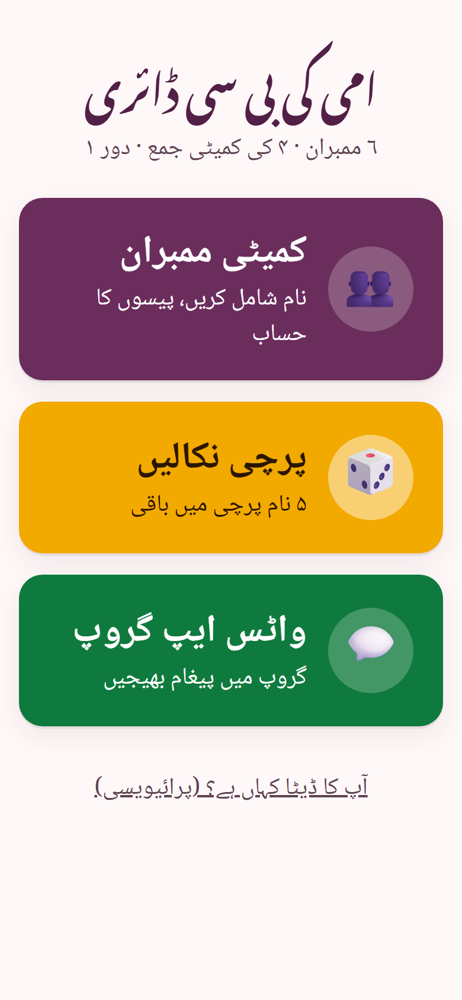
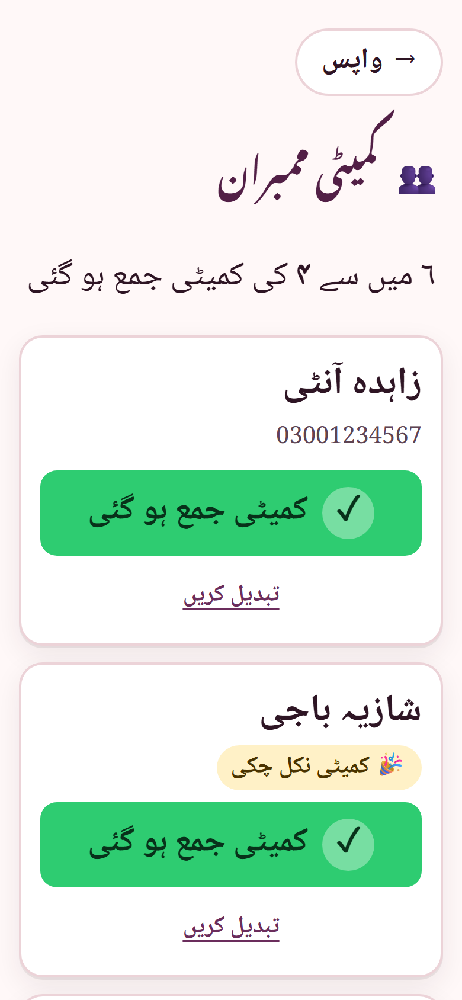
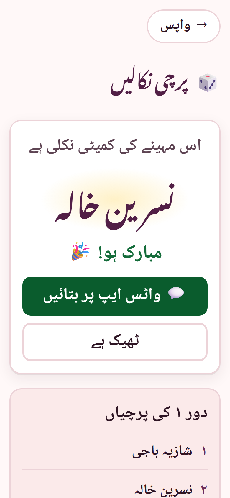

# امی کی بی سی ڈائری · Ammi Ki BC Diary

### [▶ Open the live app](https://ammi-bc-diary.vercel.app/)

A simple, Urdu-first web app for running a family committee (BC, *committee*):
the savings circle where every member pays in each month and one member,
picked by draw, takes the whole pot. It replaces the paper diary, the crossed-out
lines and the "who has paid?" WhatsApp threads with three big buttons, designed
first of all for mothers and older users.

**Live app:** [ammi-bc-diary.vercel.app](https://ammi-bc-diary.vercel.app/)

<p>
  
  
  
</p>

*Screenshots use made-up sample names.*

## Features

- **Members (ممبران).** Add a member's name and, optionally, a phone number.
  Each member has one large button that switches between
  «کمیٹی جمع ہو گئی» (paid, green) and «باقی ہے» (unpaid, red). A tally shows
  how many have paid, and «نیا مہینہ» resets everyone to unpaid for the next
  month. Duplicate names are caught, and phone numbers typed with Urdu digits
  are accepted.
- **Draw on screen (پرچی نکالیں).** Everyone watches the names roll and slow
  down until the winner's name appears in large text. The pick uses
  `crypto.getRandomValues`. A member who has won is left out of later draws in
  the same round, and a new round puts everyone back in. Past draws are kept.
- **WhatsApp (واٹس ایپ).** Ready-made Urdu messages for the draw result and for
  a payment reminder listing who still has to pay. The button opens WhatsApp
  with the text filled in, and Ammi picks the group. The group's invite link
  can be saved too, for a one-tap shortcut to the group.
- **Works offline.** All data stays on the phone in `localStorage`, and a
  service worker caches the app so it opens without internet. Screens that
  need the internet (sending to WhatsApp) say so instead of failing.
- **Made for easy reading.** Text is at least 24px, buttons are large,
  colours meet WCAG AA contrast, every field is labelled, focus is visible,
  and the draw animation is skipped when the phone asks for reduced motion.
- **Installable.** A web app manifest and icons let it be added to the home
  screen.

## Privacy

There is no backend, no account, no analytics and no cookies. Names, numbers
and draw history never leave the device; the only time anything is sent is
when Ammi taps a WhatsApp button and chooses to send the message herself. The
app's own «آپ کا ڈیٹا» screen explains this in Urdu.

## Tech stack

- React 19 (function components and hooks) and Vite
- Plain CSS with custom properties, no CSS framework
- Self-hosted fonts via Fontsource: Noto Nastaliq Urdu for headings and Noto
  Naskh Arabic for body text
- Hash routing (no server rewrites needed)
- A small hand-written service worker; the build injects the hashed asset list
- Vitest for the data and helper tests, and oxlint for linting

## Getting started

Requires Node 20.19 or newer.

```bash
git clone https://github.com/fazal305/ammi-bc-diary.git
cd ammi-bc-diary
npm install
npm run dev
```

| Script            | What it does                         |
| ----------------- | ------------------------------------ |
| `npm run dev`     | Start the dev server                 |
| `npm run build`   | Production build into `dist/`        |
| `npm run preview` | Serve the production build locally   |
| `npm test`        | Run the unit tests                   |
| `npm run lint`    | Lint with oxlint                     |

**Environment variables:** none. The app is fully static, with no backend and
no API keys.

## How it works

```
src/
  state/diary.js        reducer: members, payments, draws, rounds, group link
  state/storage.js      guarded localStorage load/save with validation
  hooks/useDiary.js     state + persistence + sync between open tabs
  lib/draw.js           fair random pick with crypto.getRandomValues
  lib/phone.js          Pakistani number normalising (03xx… → 923xx…)
  lib/whatsapp.js       wa.me share links and the Urdu messages
  lib/text.js           Urdu digits and name cleanup
  screens/              Home, Members, Draw, WhatsApp, Privacy, Not found
public/sw.js            offline cache (asset list injected at build time)
```

## Deployment

The live app is hosted on Vercel and redeploys from `main`. `vercel.json` sets
the security headers (CSP, `X-Content-Type-Options`, `Referrer-Policy`,
`frame-ancestors`) and keeps `sw.js` and `index.html` uncached so updates reach
phones quickly. CI (`.github/workflows/ci.yml`) runs lint, tests and the build
on every push and pull request.

## License

[MIT](LICENSE). Please read the [Code of Conduct](CODE_OF_CONDUCT.md) and
[Contributing guide](CONTRIBUTING.md) before opening a pull request.
